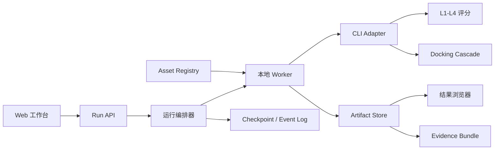

# Open Molecule Lab 产品设计规格

日期：2026-07-22  
状态：已批准  
产品名：Open Molecule Lab（暂名）

## 1. 产品定位

Open Molecule Lab 是一个本地优先、证据优先、可公开复算的药物分子虚拟筛选工作台。它将现有四级 CLI 包装成面向研究者的交互式工作流：用户从研究问题、靶点和分子库开始，完成 L1-L4 评分与可选 docking cascade，解释每条结果，并导出一份其他研究者可以理解和复算的 evidence bundle。

产品不承诺“自动发现有效药物”，不把未标注数据的排序称为验证，也不把对接级联的特定展示结果宣传为通用泛化能力。产品要解决的是运行编排、失败可见性、证据解释、版本追踪和公开复现。

### 1.1 现有能力与约束

- 现有 CLI 已提供四级评分、`auto/library/cascade` 路由、断点 checkpoint、manifest、报告和 `1000 x 10000` 批量验证。
- 正式入口包括 `four-level-molecule`、`four-level-benchmark`、`four-level-doctor` 和 `four-level-verify-snapshot`。
- 模型、完整数据、受体和 smina/obabel 是外部资产；source-only 包不包含这些文件。
- 当前许可证为 source-available，不是 OSI 开源许可证；公共发布必须携带许可和第三方数据边界。
- 当前受体注册表只覆盖有限靶点，因此无受体时必须明确走 library 分支，不能暗示完成了 docking。

### 1.2 首个用户

首个版本面向个人计算化学研究者和课题组中的模型使用者。产品形态采用单机本地 Web 工作台，支持后续导出结果给 PI、合作者和开放科学社区审阅。

## 2. 产品原则

1. **CLI 是计算内核，工作台是编排和证据层。** UI 不复制 L1-L4 或 docking 算法，也不直接拼接任意 shell 命令。
2. **状态优先于分数。** `failed`、`skipped` 和 `backend_unavailable` 必须可见，并且不能隐式变成有效的零分。
3. **运行不可变。** 参数、输入、资产或代码改变时创建新运行，不覆盖旧结果。
4. **默认可复算。** 每个完整运行都生成输入、环境、资产、命令、事件、输出和校验值。
5. **开放但不越权分发。** 不公开再分发没有许可的数据、权重、受体或二进制；公共 bundle 可以发布哈希、来源和获取说明。
6. **交互式与批量分离。** 交互体验优化单靶点和小批量，`1000 x 10000` 作为可观测的后台 benchmark，不作为默认按钮。

## 3. 系统边界和架构



### 3.1 组件

**Web UI**

负责项目、运行配置、监控、结果浏览和发布，不持有科学计算逻辑。

**Run API**

负责校验 `RunSpec`、创建项目/运行记录、返回运行状态、提供结果分页和下载接口。

**运行编排器**

将 `prepare`、`cache-layers`、`score`、`dock`、`report` 映射到现有 CLI，管理依赖、重试、取消和 resume。每个阶段开始和结束都写入 checkpoint 和结构化事件。

**CLI Adapter**

是产品层唯一调用现有 CLI 的边界。Adapter 接受版本化 `RunSpec`，调用稳定的 Python API 或 console entry point，并将 stdout、stderr 和退出码转换为结构化事件。

**本地 Worker**

隔离长任务、资源限制和子进程。第一版使用单机进程执行；后续可以替换为远程 worker，而不改变 `RunSpec` 和 evidence bundle。

**Artifact Store**

在本地文件系统中按 run ID 和内容哈希保存结果、Parquet 分区、报告和日志。SQLite 只保存元数据和索引，不把大表塞进数据库。

**Asset Registry**

读取已有资产 manifest，记录模型、数据、受体、二进制的路径、哈希、版本和许可状态。预检失败时阻止 strict 运行。

## 4. 领域对象

### 4.1 Project

```text
id, title, research_question, hypothesis, owner, created_at, visibility
```

项目保存研究上下文，不保存可变的“当前结果”。

### 4.2 Target

```text
id, target_id, target_text, uniprot_id, target_name, receptor_ref,
route_capabilities, source_refs, license_refs
```

`route_capabilities` 明确表示 `library`、`cascade` 或二者是否可用。受体路径不存在时，UI 显示原因而不是只显示一个禁用按钮。

### 4.3 MoleculeSet

```text
id, name, source_uri, input_sha256, n_rows, schema_version,
license, dedup_policy, created_at
```

分子集是不可变版本。重新清洗、去重或替换来源必须产生新 ID。

### 4.4 AssetBundle

```text
id, manifest_sha256, model_versions, data_versions,
receptor_versions, binary_versions, license_status
```

### 4.5 Run

```text
id, project_id, spec_sha256, code_revision, asset_bundle_id,
status, route_branch, created_at, started_at, finished_at
```

### 4.6 StageAttempt

```text
run_id, stage, attempt, status, input_fingerprint,
outputs, error_type, error_message, started_at, finished_at
```

阶段状态限定为 `queued`、`running`、`complete`、`failed`、`cancelled`、`blocked`。

## 5. 运行契约

一次运行由不可变的 `RunSpec` 创建：

```json
{
  "schema_version": "0.1",
  "project_id": "proj_001",
  "target": {
    "target_id": "CHEMBL2051",
    "target_text": "target text",
    "route_mode": "auto"
  },
  "molecule_set": {
    "id": "library_v3",
    "input_sha256": "...",
    "n_candidates": 10000
  },
  "policy": {
    "strict_backends": true,
    "dock_top_n": 300,
    "resume": true
  },
  "assets": {
    "asset_manifest_sha256": "...",
    "model_versions": {}
  },
  "execution": {
    "seed": 42,
    "worker": "local"
  }
}
```

UI 不直接拼接命令行参数。任何参数、资产、代码或输入变化都生成新 `run_id`。

### 5.1 分子行状态

每一层使用统一状态：

```text
ok
skipped
failed
backend_unavailable
not_evaluated
```

默认排名只使用满足正式状态要求的行；失败行保留在结果中，并显示错误类型和上下文。

### 5.2 事件

运行日志采用 JSONL，至少包括：

```json
{
  "event": "stage_checkpoint",
  "run_id": "run_001",
  "stage": "score",
  "status": "complete",
  "input_fingerprint": "...",
  "timestamp_utc": "..."
}
```

前端通过事件流刷新进度；事件日志是证据，不依赖屏幕截图。

## 6. 用户工作流和界面

### 6.1 项目首页

显示研究问题、假设、候选库版本、靶点和历史运行。每个运行显示状态、分支、资产完整度和证据完整度。

### 6.2 Run Setup

按以下顺序配置：

1. 选择靶点和候选分子集；
2. 运行输入校验、去重和许可证预检；
3. 选择 `auto`、`library` 或 `cascade`；
4. 设置严格模式、dock top-N、资源限制和随机种子；
5. 展示即将执行的阶段和预计输出。

### 6.3 Run Monitor

以阶段时间线显示 prepare、cache-layers、score、dock、report。每个阶段展示进度、checkpoint、重试次数、失败行和资源消耗；允许取消和从已验证 checkpoint 恢复。

### 6.4 Results Explorer

支持按靶点、route branch、层级状态、质量门、结构相似度和分数过滤。逐分子详情显示四层分数、属性、backend、模型 ID、对接 affinity/LE、gate reason 和失败证据。

### 6.5 Evidence / Publish

显示代码、模型、数据、受体、二进制的哈希和许可；提供报告、manifest、日志、快照和复算命令下载。公开发布前必须通过 evidence completeness 检查，检查项至少包括：RunSpec、输入哈希、代码版本、资产 manifest、环境记录、阶段 checkpoint、失败清单、结果摘要、完整性 manifest 和许可证清单。

## 7. Evidence Bundle 和开放科学发布

```text
run_bundle/
  run.json
  inputs/
  results/
    summary.parquet
    partitions/
  stages/
    prepare/
    score/
    dock/
    report/
  evidence/
    summary.json
    failure_manifest.json
    DESIGN.md
    MANIFEST.sha256
  provenance/
    environment.json
    asset_manifest.json
    run.log
  LICENSES/
```

元数据采用版本化自有 schema，并预留 RO-Crate/JSON-LD 和 W3C PROV 映射。第一版不要求实现完整标准，但字段命名必须能表达实体、活动、代理、输入、输出和生成关系。

公开发布时需要记录：

- 源码 commit 或源码包哈希；
- 运行参数、输入哈希、随机种子和依赖锁定版本；
- 模型、数据、受体、二进制版本及许可；
- 公开文件与省略文件的清单；
- 统计评价的标签层级和限制；
- 复算命令和预期结果容差。

不能公开的第三方数据只发布版本、来源、哈希和获取说明。公共发布不应声称包含完整可再分发资产。bundle 中不得写入本机绝对路径；使用相对于 bundle 的路径或经过脱敏的逻辑资源 ID。

## 8. MVP 范围

### 必须包含

- 单机本地 Web 工作台；
- 单靶点和小批量交互运行；
- 10,000 候选后台批处理；
- `auto/library/cascade` 路由；
- 断点续跑、取消和失败展示；
- 结果浏览、运行比较和 evidence bundle 导出；
- compact snapshot 验证和 `reproduce` 入口；
- 许可证和资产预检。

### 明确不包含

- 多租户云计算和计费；
- 在线模型训练；
- 自动实验设计和临床决策；
- 未确认许可的数据再分发；
- 以一个总分替代四层状态和证据；
- 将 1000 x 10000 作为普通交互按钮。

## 9. 验收标准

1. 示例数据能在 10 分钟内完成一次有效运行。
2. 中断运行可以从通过输入指纹校验的 checkpoint 恢复。
3. 任何失败或后端不可用都不会被静默转成有效分数。
4. 同一 evidence bundle 在第二个环境中可复算，结果逐列一致或符合记录的数值容差。
5. 每个运行都能追溯到代码、输入、模型、资产和环境。
6. 外部研究者可只使用公开 bundle 和许可数据理解运行边界。
7. 运行状态、分支和统计评价限制在 UI、报告和导出元数据中保持一致。

## 10. 实施阶段

### 阶段 0：契约冻结

固定 `RunSpec`、事件、状态、结果行和 bundle schema；为现有 CLI Adapter 写契约测试。

### 阶段 1：本地工作台

实现项目、候选库、靶点、Run Setup、Run Monitor 和单靶点/小批量运行。

### 阶段 2：证据和复算

实现 Artifact Store、运行比较、evidence completeness、manifest 下载和 `reproduce`。

### 阶段 3：开放发布

实现 GitHub release/公开 bundle、Quarto 或 Markdown 报告、引用元数据和后续 DOI 适配。

### 阶段 4：协作和远程 Worker

在本地 bundle 和状态机稳定后，再增加团队空间、权限和远程计算。

## 11. 风险与缓解

| 风险 | 缓解 |
| --- | --- |
| 第三方数据或权重不能再分发 | Asset Registry 强制记录许可和公开边界 |
| 模型后端缺失导致误读 | strict 预检、显式状态、禁止静默 fallback |
| 10M 结果占用过大 | 分区 Parquet、摘要优先、compact snapshot |
| 用户把排序误解为验证 | UI 显示评价层级、标签状态和统计限制 |
| 本地安装复杂 | doctor、固定依赖、示例数据和后续桌面壳 |
| 云端过早扩大范围 | 先固定本地 RunSpec 和 bundle，再抽象远程 Worker |

## 12. 当前决策请求

请审阅以下三个必须先确认的决策：

1. 首版是否采用 **Local-first + Open Science Bundle**，而不是直接做云端平台；
2. 是否接受 **RunSpec、阶段状态机、Evidence Bundle** 作为产品的核心公共契约；
3. 产品暂名是否使用 **Open Molecule Lab**，或改用其他名称。

用户确认后，下一步才进入实现计划；在确认前不改变现有评分算法和 CLI 行为。
